# 🛡️ Sentinel MITRE ATT&CK Coverage Analyzer

[](https://github.com/PowerShell/PowerShell)
[](LICENSE)
[](https://azure.microsoft.com/en-us/services/azure-sentinel/)
[](SECURITY-ASSESSMENT.md)

> **Professional MITRE ATT&CK coverage analysis for Microsoft Sentinel and Defender with interactive HTML reports**

Analyze your Microsoft Sentinel analytical rules and Defender custom detection rules to generate comprehensive MITRE ATT&CK coverage reports with beautiful visualizations, including interactive radar charts, MITRE Navigator heatmaps, table optimization insights, and executive summaries.

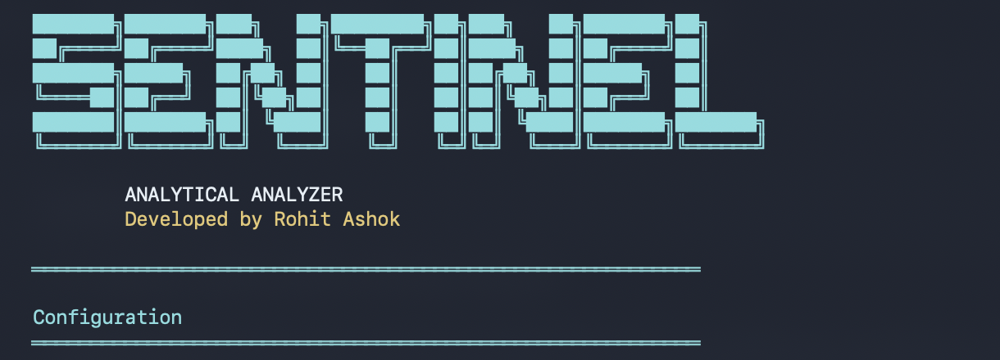

---

## 📑 Table of Contents

- [Features](#-features)
- [Prerequisites](#-prerequisites)
- [Installation](#-installation)
- [Quick Start](#-quick-start)
- [Usage](#-usage)
- [Report Sections](#-report-sections)
- [Azure Permissions](#-azure-permissions)
- [Examples](#-examples)
- [Troubleshooting](#-troubleshooting)
- [Coverage Calculation](#-coverage-calculation)
- [Security & Privacy](#-security--privacy)
- [Reference Screenshots](#-reference-screenshots)
- [License](#-license)
- [Author & Contributors](#-author--contributors)

---

## ✨ Features

 **Comprehensive Analysis**
- Sentinel analytical rules with enabled/disabled counts
- Defender custom detection rules analysis
- MITRE ATT&CK coverage against all 211 official techniques
- Multi-product coverage (MDE, MDI, MDA, MDO, Entra ID)
- Automatic sub-technique rollup (T1547.002 → T1547)
- Coverage grading (A-F scale with percentages)

**Multi-Product Support**
- **Microsoft Sentinel** - Your analytical rules (dynamic)
- **Defender Custom Rules** - Custom detection rules (optional)
- **Defender for Endpoint** - 277 built-in detections
- **Defender for Identity** - 63 built-in detections
- **Defender for Cloud Apps** - 22 built-in detections
- **Defender for Office 365** - 30 built-in detections
- **Entra ID Protection** - 21 built-in detections

**Interactive Visualizations**
- Full MITRE ATT&CK Navigator (211-technique heatmap)
- Radar/spider charts showing tactic coverage
- Coverage matrix by tactic and product
- Table optimization charts (ingestion analysis)
- Doughnut charts for Defender rule distribution
- Responsive design (desktop, tablet, mobile)

**Detailed Reporting**
- 4-tab interactive HTML interface
- Disabled rules with MITRE tactics
- Rules without MITRE mapping
- Log Analytics table usage optimization
- Gap analysis (tactics needing attention)
- Detection source summary
- Executive dashboard with key metrics

**Export Options**
- Self-contained HTML reports (~/Downloads)
- Print-optimized styling
- Single-file output (easy sharing)
- Chart.js for interactive visualizations

**Security & Privacy**
- 100% read-only operations (no writes to Azure)
- No credential storage (runtime only)
- No external data transmission
- Security rating: A+
---

## Prerequisites

 **Required**
- **PowerShell**: Version 5.1 or later
- **Azure Access**: Active Azure subscription with Sentinel deployed
- **Authentication**: One of the following:
  - Azure PowerShell module (`Az`)
  - Azure CLI
  - Managed Identity (for Azure-hosted environments)

**Optional (for Defender Custom Rules)**
- **Azure AD App Registration**: With client ID and secret
- **API Permission**: Microsoft Graph → CustomDetection.Read.All
- **Admin Consent**: Granted for the permission

**Azure Permissions**
Your Azure account must have **one** of these roles on the Sentinel workspace:

| Role | Scope | Description |
|------|-------|-------------|
| **Microsoft Sentinel Reader** | Workspace | Read access to Sentinel data (minimum required) |
| **Microsoft Sentinel Responder** | Workspace | Includes Reader + incident management |
| **Microsoft Sentinel Contributor** | Workspace | Full access to Sentinel resources |
| **Reader** | Subscription/RG | Alternative: Read access at higher scope |

---

## Installation

**Method 1: Clone from GitHub**

```powershell
# Clone the repository
git clone https://github.com/rohit8096-ag/sentinel-mitre-analyzer.git
cd sentinel-mitre-analyzer

# Import the module
Import-Module .\SentinelMITREAnalyzer.psm1
```

**Method 2: Manual Installation**

1. Download `SentinelMITREAnalyzer.psm1` and `SentinelMITREAnalyzer.psd1`
2. Place them in a folder (e.g., `C:\Tools\SentinelAnalyzer\`)
3. Import the module:

```powershell
Import-Module C:\Tools\SentinelAnalyzer\SentinelMITREAnalyzer.psm1
```

**Method 3: Direct Download**

```powershell
# Download the module file directly
Invoke-WebRequest -Uri "https://raw.githubusercontent.com/rohit8096-ag/sentinel-mitre-analyzer/main/SentinelMITREAnalyzer.psm1" -OutFile "SentinelMITREAnalyzer.psm1"

# Download manifest
Invoke-WebRequest -Uri "https://raw.githubusercontent.com/rohit8096-ag/sentinel-mitre-analyzer/main/SentinelMITREAnalyzer.psd1" -OutFile "SentinelMITREAnalyzer.psd1"

# Import the module
Import-Module .\SentinelMITREAnalyzer.psm1
```

---

## Quick Start

**Step 1: Authenticate to Azure**

```powershell
# Option A: Using Azure CLI  (Recommended)
az login
az account set --subscription 'your-subscription-id'

# Option B: Using Az PowerShell
Install-Module Az -Scope CurrentUser -Force
Connect-AzAccount
Set-AzContext -SubscriptionId 'your-subscription-id'


```

**Step 2: Gather Required Information**

```powershell
# Get your Subscription ID
az account show --query id -o tsv

# Get your Workspace ID (GUID)
az monitor log-analytics workspace show \
  --resource-group "your-resource-group" \
  --workspace-name "your-workspace-name" \
  --query customerId -o tsv
```

**Step 3: Run the Analyzer**

**Scenario A: Sentinel + Default Defender Products**

```powershell
# Import the module
Import-Module .\SentinelMITREAnalyzer.psm1 -Force

# Generate HTML report
Get-SentinelAnalyticalRulesReport `
    -SubscriptionId (az account show --query id -o tsv) `
    -ResourceGroup "your-resource-group" `
    -WorkspaceName "your-workspace-name" `
    -WorkspaceId "your-workspace-guid" `
    -ExportHtml
```

**What you get:**
- Sentinel analytical rules analysis
- Default product coverage (MDE, MDI, MDA, MDO, Entra ID)
- Table optimization insights
- 6 Detection Sources
- ~37-52% baseline coverage

---

 **Scenario B: Full Coverage (+ Defender Custom Rules)**

```powershell
# Import the module
Import-Module .\SentinelMITREAnalyzer.psm1 -Force

# Generate HTML report with Defender Custom Rules
Get-SentinelAnalyticalRulesReport `
    -SubscriptionId (az account show --query id -o tsv) `
    -ResourceGroup "your-resource-group" `
    -WorkspaceName "your-workspace-name" `
    -WorkspaceId "your-workspace-guid" `
    -TenantId "your-tenant-id" `
    -ClientId "your-app-client-id" `
    -ClientSecret "your-app-secret" `
    -ExportHtml
```

**What you get:**
- Everything from Scenario A, PLUS:
- Defender Custom Detection Rules analysis
- Enhanced MITRE coverage (typically 60-75%)
- 7 Detection Sources
- Defender-specific insights

---

**Step 4: View Your Report**

The HTML report will be saved to:
- **Windows**: `C:\Users\YourName\Downloads\Sentinel Analytical Analyzer.html`
- **macOS/Linux**: `~/Downloads/Sentinel Analytical Analyzer.html`

Double-click to open in your browser!

---

## Usage

**Basic Usage (Interactive Mode)**

```powershell
# Import module
Import-Module .\SentinelMITREAnalyzer.psm1

# Run with minimal parameters (will use Az context)
Get-SentinelAnalyticalRulesReport -ExportHtml

# You'll be prompted for:
# - Resource Group
# - Workspace Name
# - Workspace ID (if not auto-detected)
```

**Non-Interactive Mode (Recommended)**

```powershell
# Provide all parameters explicitly
Get-SentinelAnalyticalRulesReport `
    -SubscriptionId 'xxxxxxxx-xxxx-xxxx-xxxx-xxxxxxxxxxxx' `
    -ResourceGroup 'rg-sentinel-prod' `
    -WorkspaceName 'sentinelworkspace01' `
    -WorkspaceId 'yyyyyyyy-yyyy-yyyy-yyyy-yyyyyyyyyyyy' `
    -ExportHtml
```

 **With Defender Custom Rules**

```powershell
# Full coverage analysis including Defender
Get-SentinelAnalyticalRulesReport `
    -SubscriptionId (az account show --query id -o tsv) `
    -ResourceGroup 'rg-sentinel-prod' `
    -WorkspaceName 'sentinelworkspace01' `
    -WorkspaceId 'yyyyyyyy-yyyy-yyyy-yyyy-yyyyyyyyyyyy' `
    -TenantId 'zzzzzzzz-zzzz-zzzz-zzzz-zzzzzzzzzzzz' `
    -ClientId 'aaaaaaaa-aaaa-aaaa-aaaa-aaaaaaaaaaaa' `
    -ClientSecret 'your-secret-value' `
    -ExportHtml
```

---

## Report Sections

**Tab 1: Sentinel Analytical Rule Analysis**

**1. Overview**
Summary statistics including:
- Total rules (enabled + disabled)
- Enabled rules count
- Disabled rules count
- MITRE coverage percentage with grade (A-F)

**2. MITRE ATT&CK Tactics Coverage (Radar Chart)**
Interactive spider/radar chart showing enabled rule coverage across all 14 MITRE tactics.

**3. Enabled Rules by Tactic**
Table displaying the number of enabled and disabled rules for each MITRE tactic.

**4. Coverage Gaps**
Gap analysis showing the top 5 tactics with the fewest enabled rules, prioritized for improvement.

**5. Disabled Rules**
Complete list of inactive rules with:
- Rule name
- MITRE tactics
- Last modified date

---

**Tab 2: Table Optimization**

**1. Overview**
Statistics about Log Analytics table usage:
- Tables analyzed (last 30 days)
- Tables with detection rules
- Unused tables (cost optimization opportunities)
- Total ingestion volume (GB)

**2. Top Tables by Ingestion (Chart)**
Bar chart showing highest-cost tables by data volume.

**3. Table Details**
Table listing:
- Table name
- Ingestion volume (GB)
- Number of rules using this table
- Status (Active/Unused)

**4. Optimization Tips**
Recommendations for:
- Tables with high ingestion + no rules
- Potential cost savings
- Retention policy adjustments

---

**Tab 3: Defender Custom Rules**

**Note**: Only shown if you provide TenantId, ClientId, and ClientSecret.

 **1. Overview**
- Total Defender custom rules
- Enabled custom rules
- Disabled custom rules

**2. Rules by MITRE Tactic (Doughnut Chart)**
Visual distribution of Defender rules across MITRE tactics.

**3. Tactic Distribution Table**
Count of Defender rules per MITRE tactic.

 **4. Disabled Defender Rules**
List of inactive Defender custom detection rules.

---

**Tab 4: Overall MITRE Coverage HeatMap**

**1. Stats Cards**
- Sentinel Rules (Enabled)
- Defender Custom Rules
- Detection Sources (6 or 7)
- Overall MITRE Coverage (%)

**2. MITRE ATT&CK Navigator View**
Full 211-technique heatmap with color coding:
- **Red**: No coverage (0 rules)
- **Light Green**: Limited coverage (1 rule)
- **Green**: Good coverage (2+ rules)

**3. Coverage Matrix by Tactic**
Shows unique MITRE techniques covered per tactic by each product:
- Sentinel
- Defender Custom
- Defender for Endpoint (MDE)
- Defender for Identity (MDI)
- Defender for Cloud Apps (MDA)
- Defender for Office 365 (MDO)
- Entra ID Protection

**Important**: Numbers indicate unique technique count, not rule count.

**4. Detection Source Summary**
Lists all detection sources:
- Product name
- Total rule count
- Status (Active/Default)

---

##  Azure Permissions

**Required API Permissions**

The analyzer uses these Azure APIs:

```
Sentinel Rules API:
  Endpoint: https://management.azure.com/.../Microsoft.SecurityInsights/alertRules
  Permission: Reader on workspace

Log Analytics API:
  Endpoint: https://api.loganalytics.io/v1/workspaces/{id}/query
  Permission: Reader on workspace

Microsoft Graph API (Optional):
  Endpoint: https://graph.microsoft.com/v1.0/security/rules/detectionRules
  Permission: CustomDetection.Read.All (Application)
```

### Assigning Permissions

**Via Azure Portal**
1. Navigate to your **Log Analytics Workspace**
2. Click **Access control (IAM)**
3. Click **Add** → **Add role assignment**
4. Select **Microsoft Sentinel Reader**
5. Search for and select your user/service principal
6. Click **Save**

**Via Azure CLI**
```bash
# Get the workspace resource ID
WORKSPACE_ID=$(az monitor log-analytics workspace show \
  --resource-group my-rg \
  --workspace-name my-workspace \
  --query id -o tsv)

# Assign the role
az role assignment create \
  --assignee user@domain.com \
  --role "Microsoft Sentinel Reader" \
  --scope $WORKSPACE_ID
```

**Via PowerShell**
```powershell
# Get the workspace
$workspace = Get-AzOperationalInsightsWorkspace `
    -ResourceGroupName 'my-rg' `
    -Name 'my-workspace'

# Assign the role
New-AzRoleAssignment `
    -SignInName 'user@domain.com' `
    -RoleDefinitionName 'Microsoft Sentinel Reader' `
    -Scope $workspace.ResourceId
```

**Role Capabilities**

| Action | Reader | Responder | Contributor |
|--------|--------|-----------|-------------|
| View analytical rules | ✅ | ✅ | ✅ |
| View rule properties | ✅ | ✅ | ✅ |
| View MITRE mappings | ✅ | ✅ | ✅ |
| Query Log Analytics | ✅ | ✅ | ✅ |
| Modify rules | ❌ | ❌ | ✅ |
| Create rules | ❌ | ❌ | ✅ |
| Delete rules | ❌ | ❌ | ✅ |

**Note**: This analyzer only requires **read access** (Reader role is sufficient).

---

## Defender Integration

**Why Integrate Defender Custom Rules?***

Including Defender Custom Detection Rules provides:
- **Enhanced Coverage**: Additional 10-20% MITRE coverage
- **Complete Visibility**: See detections across all Microsoft security products
- **Gap Analysis**: Identify overlaps and gaps between Sentinel and Defender
- **Unified Reporting**: Single view of entire security stack

**Setup Instructions**

**1. Create App Registration**

```powershell
# In Azure Portal:
# → Azure Active Directory
# → App registrations
# → New registration

Name: Sentinel-MITRE-Analyzer
Supported account types: Single tenant
Redirect URI: (leave blank)

# Click "Register"
```

**2. Create Client Secret**

```powershell
# In your App Registration:
# → Certificates & secrets
# → New client secret

Description: SentinelMITREAnalyzer
Expires: 12 months (or your preference)

# Click "Add"
# ⚠️ COPY THE SECRET VALUE NOW!
```

**3. Copy Required IDs**

```powershell
# From App Registration "Overview":
Application (client) ID: abcdef12-3456-7890-abcd-ef1234567890
Directory (tenant) ID: 87654321-4321-4321-4321-210987654321

# From Certificates & secrets:
Client secret value: abc...xyz
```

**4. Grant API Permissions**

```powershell
# In App Registration:
# → API permissions
# → Add a permission
# → Microsoft Graph
# → Application permissions
# → Search: CustomDetection
# → Check: CustomDetection.Read.All
# → Add permissions
```

**5. Grant Admin Consent**

```powershell
# In API permissions page:
# → Click "Grant admin consent for [Your Org]"
# → Confirm "Yes"

# ✅ Green checkmarks should appear
```

**6. Test Your Setup**

```powershell
Get-SentinelAnalyticalRulesReport `
    -SubscriptionId (az account show --query id -o tsv) `
    -ResourceGroup "your-rg" `
    -WorkspaceName "your-workspace" `
    -WorkspaceId "your-workspace-id" `
    -TenantId "87654321-4321-4321-4321-210987654321" `
    -ClientId "abcdef12-3456-7890-abcd-ef1234567890" `
    -ClientSecret "your-secret-value" `
    -ExportHtml

# Tab 3 should now show your Defender Custom Rules!
```

---

## Examples

**Example 1: Quick Security Assessment**

```powershell
# Generate report for quick review
Import-Module .\SentinelMITREAnalyzer.psm1
Get-SentinelAnalyticalRulesReport `
    -SubscriptionId (az account show --query id -o tsv) `
    -ResourceGroup "rg-sentinel" `
    -WorkspaceName "sentinel-ws" `
    -WorkspaceId "workspace-guid" `
    -ExportHtml

# Open report in default browser
$reportPath = Join-Path $env:USERPROFILE "Downloads\Sentinel Analytical Analyzer.html"
Start-Process $reportPath
```

**Example 2: Weekly Coverage Report (Scheduled)**

```powershell
# Save as Run-WeeklyCoverageReport.ps1
Import-Module .\SentinelMITREAnalyzer.psm1

Get-SentinelAnalyticalRulesReport `
    -SubscriptionId (az account show --query id -o tsv) `
    -ResourceGroup "rg-sentinel-prod" `
    -WorkspaceName "sentinelworkspace01" `
    -WorkspaceId "workspace-guid" `
    -TenantId "tenant-id" `
    -ClientId "client-id" `
    -ClientSecret $env:DEFENDER_SECRET `
    -ExportHtml

# Schedule with Task Scheduler to run weekly
```

**Example 3: Multi-Workspace Analysis**

```powershell
# Analyze multiple Sentinel workspaces
$workspaces = @(
    @{ RG = "rg-prod"; Name = "prod-ws"; ID = "guid1" }
    @{ RG = "rg-dev"; Name = "dev-ws"; ID = "guid2" }
)

foreach ($ws in $workspaces) {
    Write-Host "Analyzing $($ws.Name)..." -ForegroundColor Cyan
    
    Get-SentinelAnalyticalRulesReport `
        -SubscriptionId (az account show --query id -o tsv) `
        -ResourceGroup $ws.RG `
        -WorkspaceName $ws.Name `
        -WorkspaceId $ws.ID `
        -ExportHtml
    
    # Rename output file
    $oldPath = Join-Path $env:USERPROFILE "Downloads\Sentinel Analytical Analyzer.html"
    $newPath = Join-Path $env:USERPROFILE "Downloads\$($ws.Name)-Coverage-Report.html"
    Move-Item $oldPath $newPath -Force
}
```

---

## Troubleshooting

**Issue: "Authentication failed"**

**Symptoms**: Script fails at authentication step

**Solutions**:
```powershell
# Check if you're logged in
Get-AzContext  # For Az PowerShell
az account show  # For Azure CLI

# Re-authenticate
Connect-AzAccount
# or
az login

# Set correct subscription
Set-AzContext -SubscriptionId 'your-sub-id'
# or
az account set --subscription 'your-sub-id'
```

---

**Issue: "HTTP 403 Forbidden"**

**Symptoms**: Authentication succeeds but API calls fail

**Cause**: Missing RBAC permissions

**Solution**:
```powershell
# Verify your role assignments
Get-AzRoleAssignment -SignInName (Get-AzContext).Account.Id | 
    Where-Object { $_.RoleDefinitionName -like "*Sentinel*" }

# If no roles shown, request access from your Azure admin
```

---

**Issue: "HTTP 404 Not Found"**

**Symptoms**: "Resource not found" error

**Cause**: Incorrect subscription, resource group, or workspace name

**Solution**:
```powershell
# List all Sentinel workspaces you have access to
Get-AzOperationalInsightsWorkspace | 
    Select-Object Name, ResourceGroupName, Location |
    Format-Table

# Use exact names from the output above
```

---

**Issue: "Radar chart is blank"**

**Symptoms**: HTML report opens but chart doesn't render

**Cause**: No internet connection (Chart.js loads from CDN)

**Solution**:
- Ensure internet connectivity when opening the HTML
- Chart.js CDN URL: `https://cdn.jsdelivr.net/npm/chart.js@4.4.0`
- Try opening in a different browser (Chrome, Edge, Firefox)

---

**Issue: "Defender data not showing"**

**Symptoms**: Tab 3 is empty

**Cause**: Missing TenantId/ClientId/ClientSecret OR permission not granted

**Solution**:
- Verify all three parameters provided
- Check App Registration has CustomDetection.Read.All
- Verify admin consent granted
- Check client secret hasn't expired

---

**Issue: "Token expired"**

**Symptoms**: Script worked before but now fails with 401

**Solution**:
```powershell
# Tokens expire after 1 hour by default
# Simply re-authenticate
Connect-AzAccount -Force
# or
az login --use-device-code
```

---

**Issue: "Az module not found"**

**Symptoms**: "Get-AzContext command not found"

**Solution**:
```powershell
# Install Az PowerShell module
Install-Module Az -Scope CurrentUser -Force -AllowClobber

# Import the module
Import-Module Az

# Verify installation
Get-Module Az -ListAvailable
```

---

## Coverage Calculation

**Formula**

```
Overall Coverage % = (Unique MITRE Techniques from All Sources / 211 Total Techniques) × 100
```

**Grading Scale**

| Grade | Coverage Range | Description |
|-------|----------------|-------------|
| **A** | 80-100% | ✅ Excellent - Comprehensive coverage |
| **B** | 60-79% | ✅ Good - Above average coverage |
| **C** | 40-59% | ⚠️ Moderate - Room for improvement |
| **D** | 20-39% | ⚠️ Limited - Significant gaps |
| **F** | 0-19% | ❌ Critical - Major coverage gaps |

---

## Security & Privacy

**Security Features**
- ✅ **100% Read-Only** - No write operations to Azure
- ✅ **No Credential Storage** - Credentials used at runtime only
- ✅ **HTTPS-Only** - All API calls use HTTPS
- ✅ **Minimal Permissions** - Reader role sufficient
- ✅ **No Data Transmission** - Output stays local
- ✅ **OWASP Compliant** - Follows OWASP Top 10 best practices

### Security Rating
**Overall: A+ 
---

## 📸 Reference Screenshots
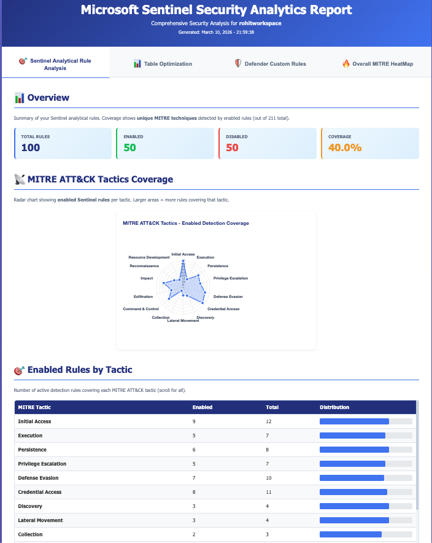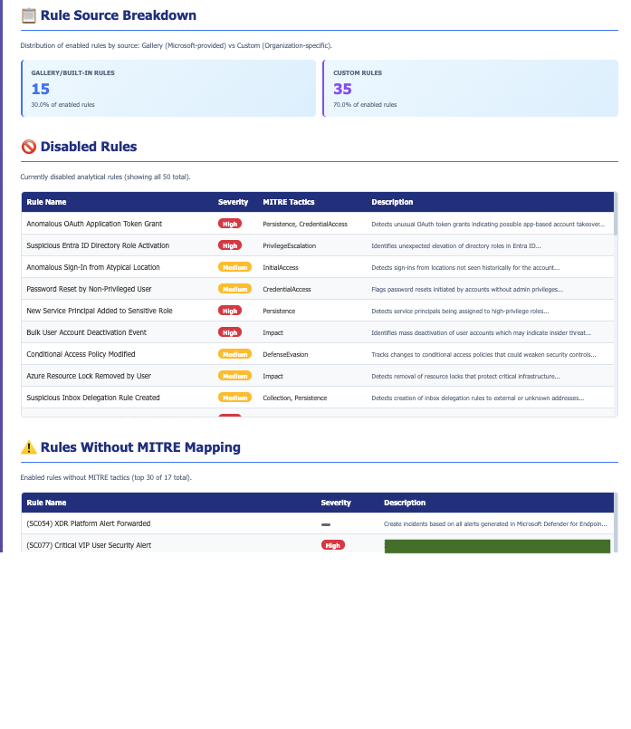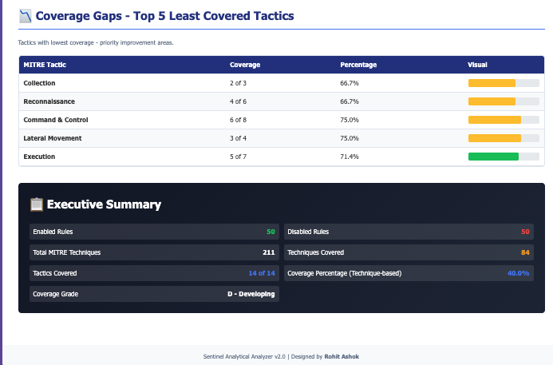
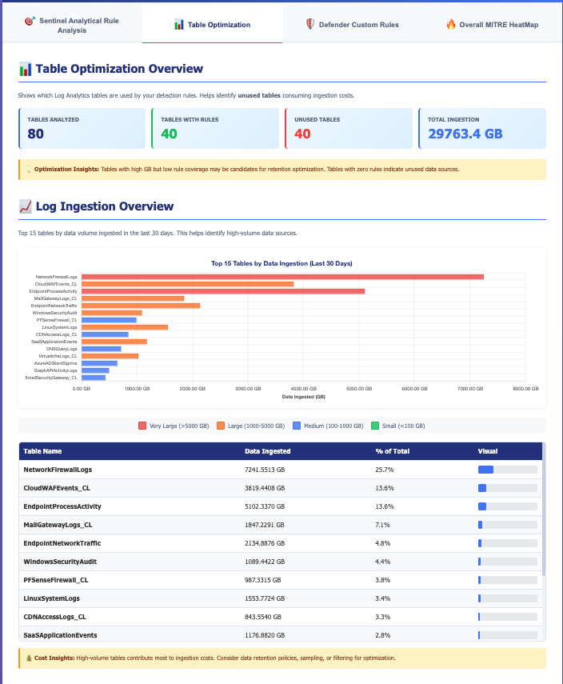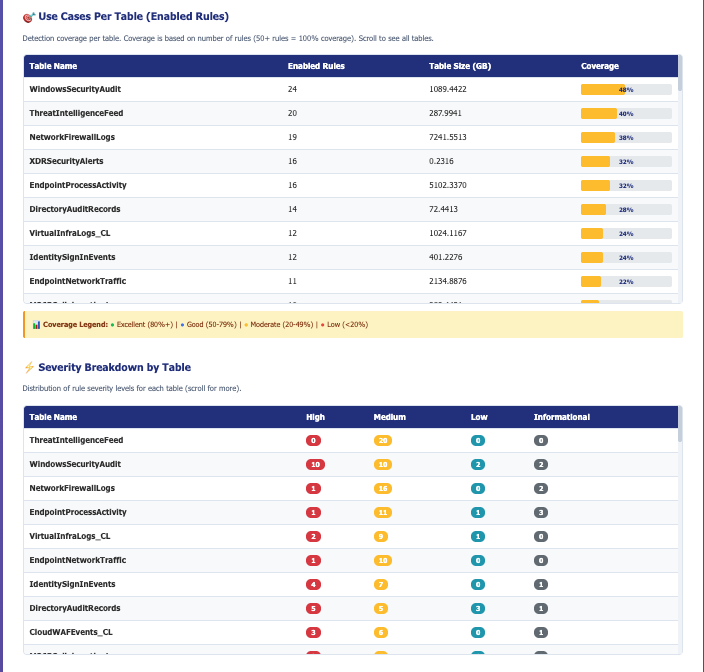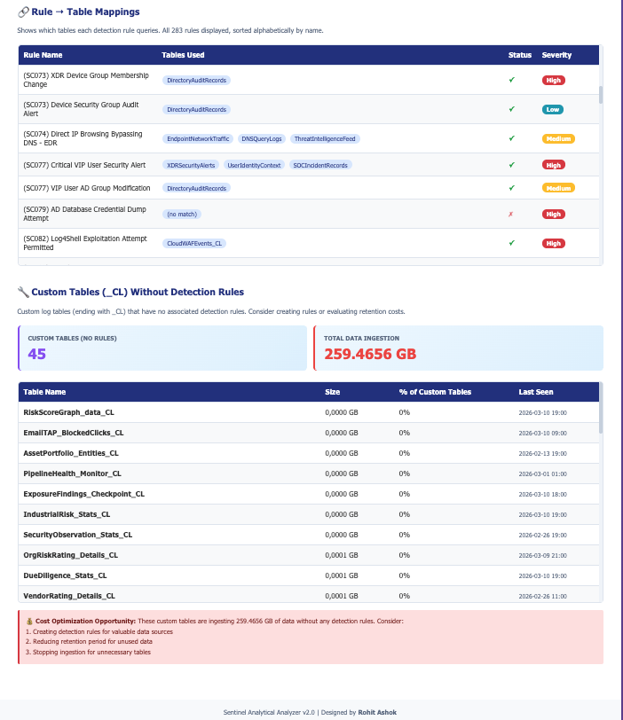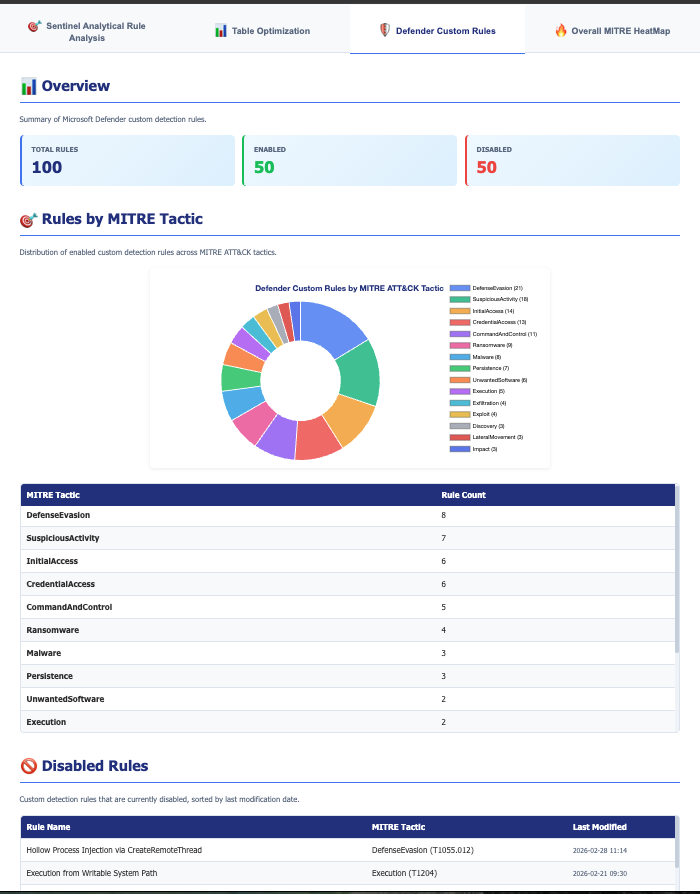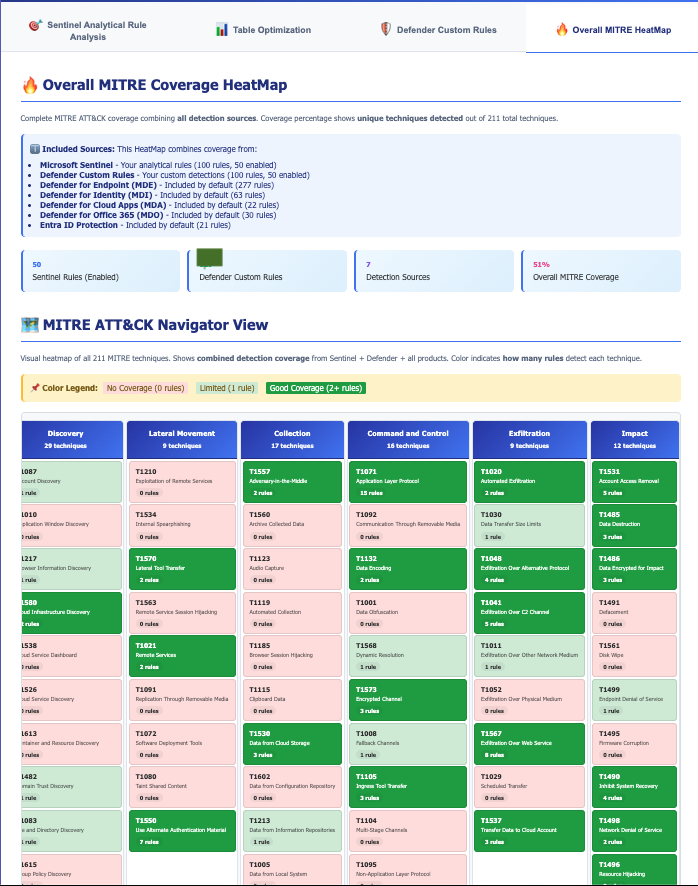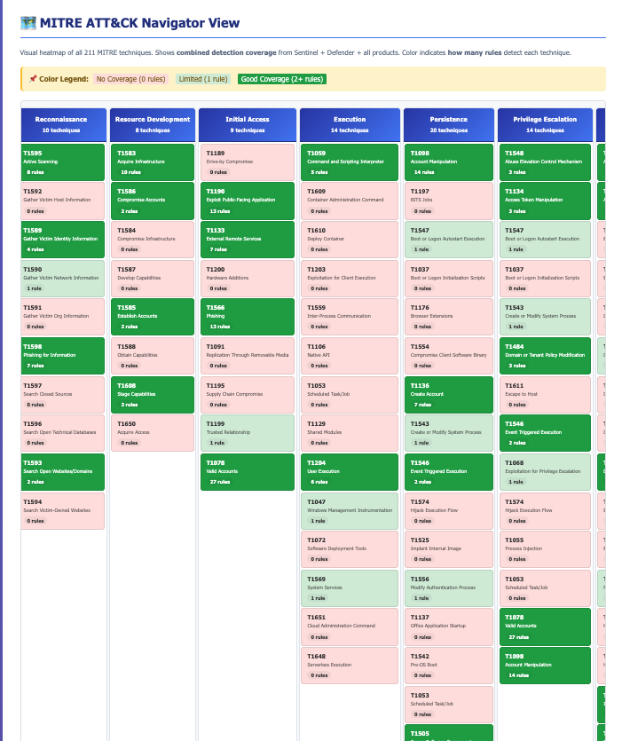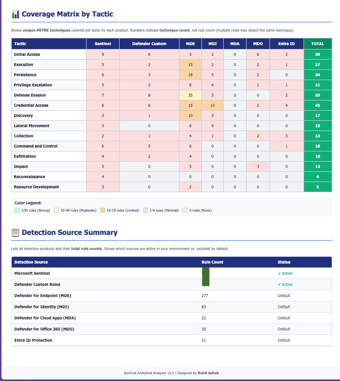

---

## 📄 License

This project is licensed under the MIT License - see the [LICENSE](LICENSE) file for details.

---

## 👤 Author & Contributors

**Rohit Ashok**
- GitHub: [@rohit8096-ag](https://github.com/rohit8096-ag)
- LinkedIn: [Rohit Ashok](https://www.linkedin.com/in/rohit-ashokgoud-5b77a0188)

**Contributors:**
- @claude - Development assistance and documentation

---

**Made with ❤️ for the security community**

**Version 2.0.0** | Last Updated: March 10, 2026
